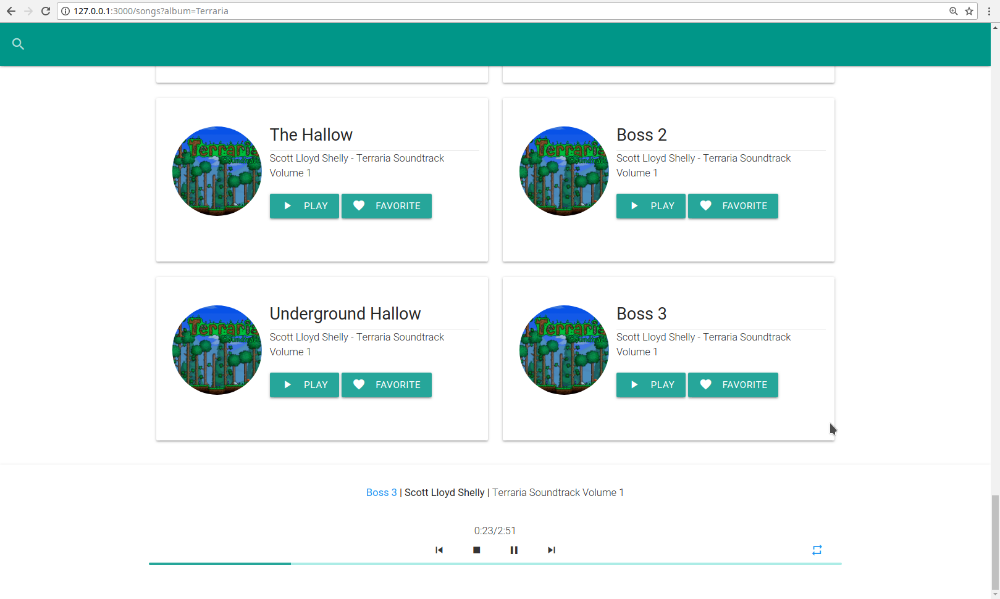

# zstream-server

> A music streaming server written from scratch to stream your home library



## Installation

If you want a static installation on your system, use the following:

```bash
npm install -g zstream-server
```

If you want a simple one-command solution for installing, updating, and running ZStream:

```bash
npx zstream-server
```

## Usage

To use ZStream, all you have to do is run the `zstream` (or `npx zstream-server`) command while inside a music folder. ZStream will attempt to extract metadata from the song files themselves, but if that fails, it resorts to the folder structure for extrapolating song information. In order for it to correctly identify your music, the folder structure should be as follows:

    root
    ├── Artist 1
    │   ├── Album 1
    │   │   ├── Track 1
    │   │   ├── Track 2
    │   │   ├── Track 3
    │   │   └── ...
    │   └── Album 2
    │       └── ...
    ├── Artist 2
    │   ├── Album 1
    │   └── ...
    └── ...

Then you simply run `zstream` (or `npx zstream-server`) from within the root directory. All music will be automatically loaded and served to `127.0.0.1:3000`.
